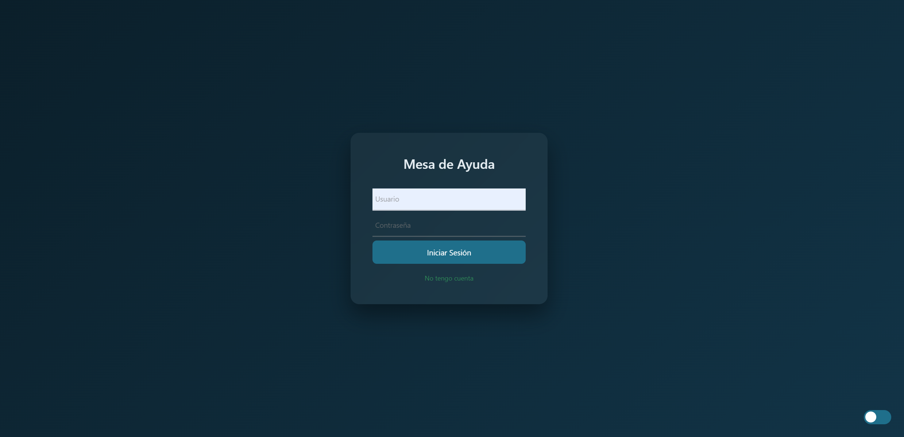
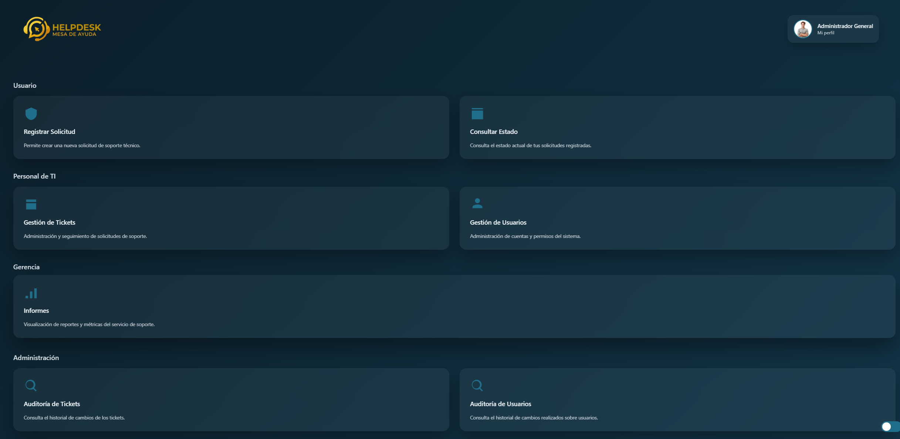
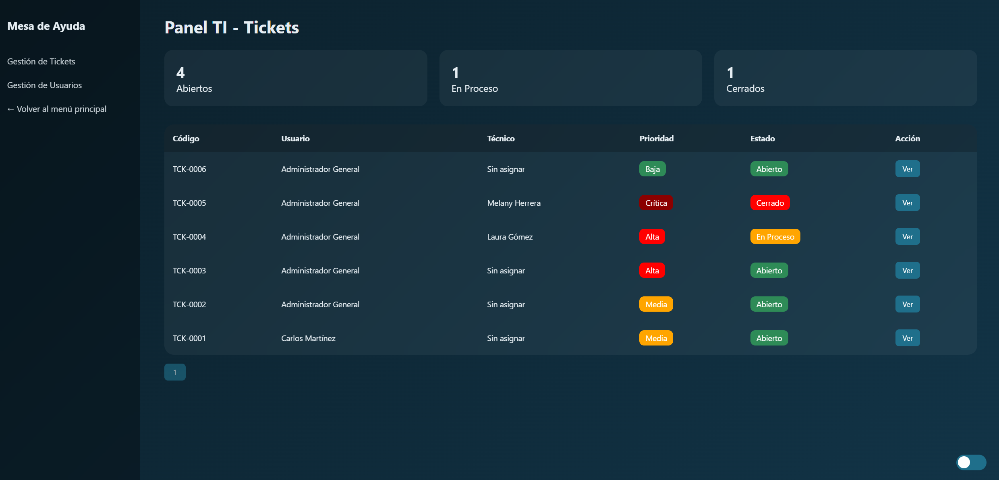
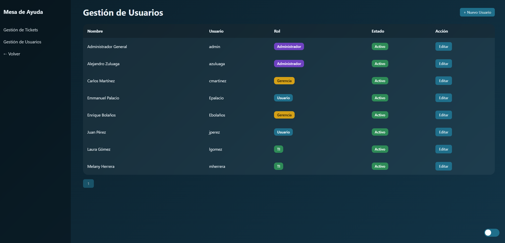
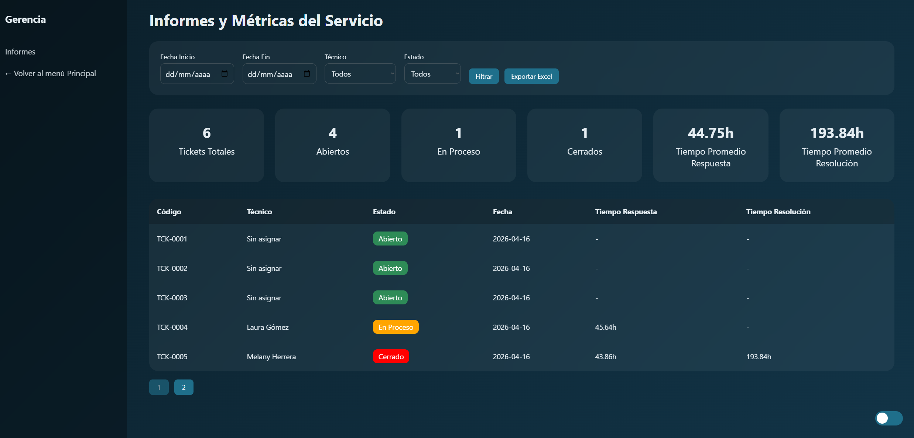

# MesaDeAyuda


Sistema web de gestión de tickets e incidencias desarrollado en ASP.NET Core MVC y SQL Server.

## Descripción

MesaDeAyuda es una plataforma diseñada para centralizar la gestión de solicitudes de soporte técnico dentro de una organización.

El sistema permite a los usuarios registrar incidencias, realizar seguimiento a sus solicitudes y consultar el historial de atención. Por su parte, el personal de soporte puede gestionar tickets, asignar responsables, actualizar estados y generar reportes de desempeño.

## Características principales

* Autenticación de usuarios.
* Gestión de roles y permisos.
* Creación de tickets de soporte.
* Asignación de técnicos.
* Seguimiento del ciclo de vida de los tickets.
* Historial de cambios y auditoría.
* Gestión de usuarios.
* Comentarios sobre tickets.
* Adjuntos y evidencias.
* Reportes exportables a Excel.
* Dashboard administrativo.
* Soporte para tema claro y oscuro.

## Roles disponibles

* Administrador
* Soporte de TI
* Usuario
* Gerencia

## Funcionalidades por rol

### Administrador

- Gestión de usuarios.
- Gestión de roles.
- Administración general del sistema.
- Consulta de reportes.
- Revisión de auditorías.

### Soporte de TI

- Gestión y seguimiento de tickets.
- Actualización de estados.
- Atención de incidencias.

### Usuario

- Creación de solicitudes.
- Consulta del estado de sus tickets.
- Seguimiento del historial de atención.

### Gerencia

- Consulta de indicadores y reportes.
- Seguimiento general de la operación.

## Tecnologías utilizadas

### Backend

* ASP.NET Core MVC
* Entity Framework Core
* SQL Server

### Frontend

* Razor Views
* Bootstrap
* JavaScript
* CSS personalizado

### Seguridad

* Hash de contraseñas
* Control de acceso basado en roles
* Autenticación mediante cookies

## Arquitectura

MesaDeAyuda sigue el patrón de arquitectura MVC (Model-View-Controller) proporcionado por ASP.NET Core, separando las responsabilidades de la aplicación en capas para facilitar su mantenimiento y escalabilidad.

### Controllers

Contienen la lógica de aplicación y gestionan las solicitudes HTTP recibidas desde la interfaz de usuario. Se encargan de procesar la información, interactuar con la capa de datos y devolver las vistas correspondientes.

### Models

Representan las entidades del sistema y las estructuras utilizadas para el intercambio de información entre la aplicación y la base de datos.

### Views

Implementadas mediante Razor Views, constituyen la interfaz de usuario de la aplicación y permiten la interacción entre los usuarios y el sistema.

### Data

Gestiona el acceso a datos mediante Entity Framework Core, incluyendo el contexto de base de datos y las configuraciones necesarias para la persistencia de información.

### Helpers

Contiene utilidades y componentes reutilizables que encapsulan lógica auxiliar utilizada en diferentes módulos de la aplicación.

### Base de Datos

La persistencia de datos se realiza mediante SQL Server, almacenando información relacionada con usuarios, roles, tickets, comentarios, estados, prioridades y registros de auditoría.


## Estructura del proyecto

```text
Controllers/
Data/
Database/
Helpers/
Models/
Views/
wwwroot/
```

## Instalación

### 1. Clonar el repositorio

```bash
git clone https://github.com/Alezululo/MesaDeAyuda.git
```

### 2. Crear la base de datos

Ejecutar el archivo:

```text
Database/Schema_and_Data.sql
```

en SQL Server Management Studio.

### 3. Configurar la cadena de conexión

Editar el archivo:

```text
appsettings.json
```

y actualizar la cadena de conexión según el entorno local.

### 4. Ejecutar la aplicación

```bash
dotnet restore
dotnet build
dotnet run
```

## Credenciales de prueba

### Administrador

Usuario:

```text
admin
```

Contraseña:

```text
1234
```

Usuario:

```text
azuluaga
```

Contraseña:

```text
1234
```

### Soporte de TI

Usuario:

```text
lgomez
```

Contraseña:

```text
1234
```

Usuario:

```text
mherrera
```

Contraseña:

```text
1234
```

### Usuario

Usuario:

```text
jperez
```

Contraseña:

```text
1234
```

Usuario:

```text
epalacio
```

Contraseña:

```text
1234
```

### Gerencia

Usuario:

```text
cmartinez
```

Contraseña:

```text
1234
```

## Capturas de pantalla

### Inicio de sesión



### Dashboard principal



### Gestión de tickets



### Gestión de usuarios



### Informes



## Integración Continua (CI)

El repositorio puede utilizar GitHub Actions para ejecutar automáticamente:

* Restauración de dependencias
* Compilación del proyecto
* Validación de errores de compilación

Cada cambio enviado al repositorio puede ser verificado automáticamente antes de su despliegue.

## Autor

Alejandro Zuluaga López

Proyecto desarrollado como evidencia final del programa Tecnólogo en Análisis y Desarrollo de Software del SENA.
